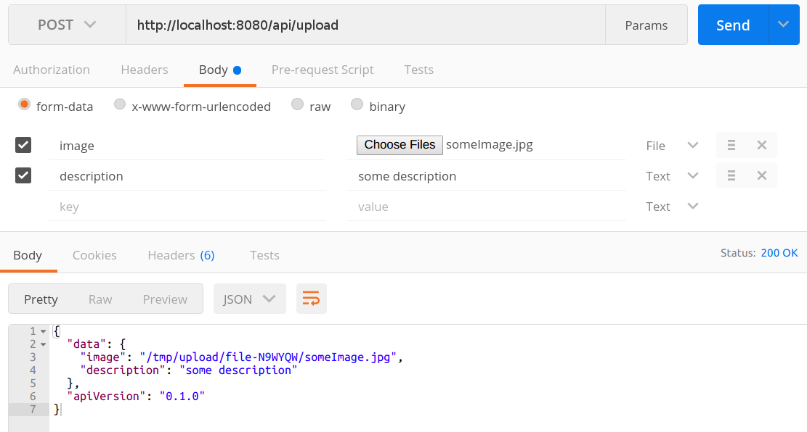
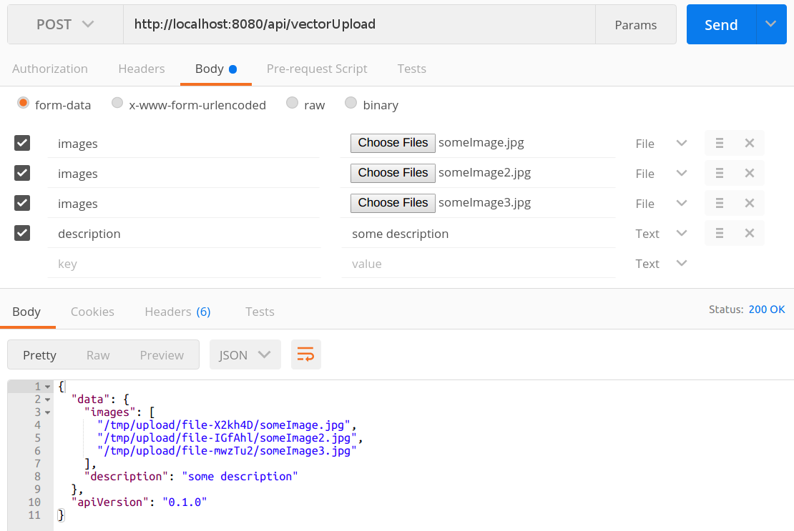
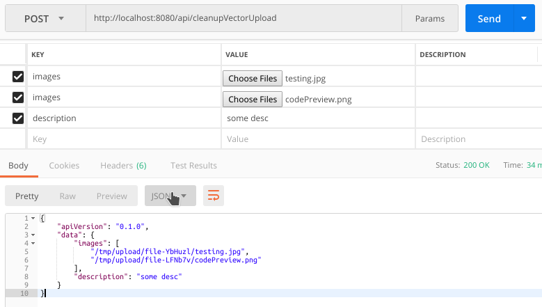

<p align="center">
  
</p>

## Super basic upload examples using express

Running example:
```
git clone https://github.com/meboHQ/example-uploads.git
cd example-uploads
npm install
NODE_ENV=development node .
```

## Requirements
- Node 8 or greater
- Express 4 or greater

## Actions

### Single Upload
`POST: http://localhost:8080/api/upload`



##### *running on [postman](https://www.getpostman.com)*

---

###  Vector Upload
`POST: http://localhost:8080/api/vectorUpload`



##### *running on [postman](https://www.getpostman.com)*

---

###  Vector Upload With Clean-up
`POST: http://localhost:8080/api/cleanupVectorUpload`



##### *running on [postman](https://www.getpostman.com)*

## Licensing
Mebo is free software; you can redistribute it and/or modify it under the terms of the MIT License
